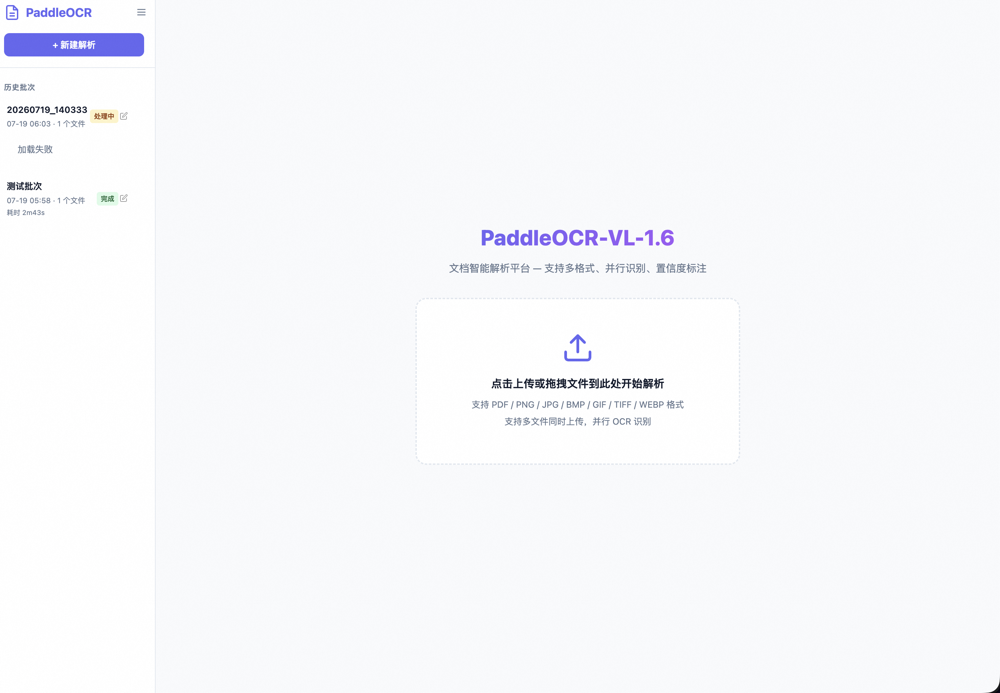

# MathOCR — PaddleOCR-VL 文档解析平台

基于 PaddleOCR-VL-1.6 的文档智能解析平台,支持 PDF/图片多格式输入,并行 OCR 识别,原图与解析结果对比(含置信度色块标注),历史批次管理,Markdown/Word 导出。



## 功能特性

- **多文件批量上传** — 支持同时上传多个文件,自动生成批次号(年月日时分秒)
- **并行 OCR 识别** — 多文件并行处理,任务队列管理
- **原图对比查看** — 左右分栏对比原图(带边界框标注)与解析结果,支持全屏放大
- **置信度色块** — 每个识别区域以颜色标注置信度(绿/蓝/黄/红),快速定位低置信度内容
- **历史批次管理** — SQLite 存储元数据,支持别名、按状态筛选、处理耗时追踪
- **实时进度推送** — SSE (Server-Sent Events) 实时推送处理进度,无需轮询
- **文件级进度** — 显示每个文件的解析页数/总页数、处理耗时、完成时间
- **侧边栏可收起** — 点击收起按钮展开/收起侧边栏,状态持久化
- **多格式导出** — 支持 Markdown 和 Word (.docx) 导出,Word 还原布局含表格图片
- **魔搭模型源** — 默认从 ModelScope 下载模型,国内访问更稳定

## 技术栈

| 层 | 技术 | 说明 |
|---|---|---|
| 后端框架 | Robyn | Rust 内核 Python Web 框架,高性能 |
| OCR 引擎 | PaddleOCR-VL-1.6 | 百度飞桨文档解析模型 |
| 元数据存储 | SQLite | 内置于 Python 标准库,轻量 OLTP |
| 实时推送 | SSE | Server-Sent Events,Robyn StreamingResponse |
| 任务队列 | 内存队列 | 单工作线程顺序处理批次 |
| PDF 渲染 | PyMuPDF | 高性能 PDF 页面渲染 |
| 前端构建 | Bun | 高性能 JS 运行时与打包工具 |
| 前端渲染 | marked.js + KaTeX | Markdown + LaTeX 公式渲染 |
| 包管理 | UV (Python) + Bun (前端) | |

## 快速开始

### 一键启动

```bash
./start.sh
```

脚本会自动完成:
1. 检查并安装 UV、Bun
2. 创建 Python 虚拟环境
3. 安装所有依赖 (PaddlePaddle, PaddleOCR, Robyn, SQLite 等)
4. 安装前端依赖并构建
5. 配置魔搭 ModelScope 模型源
6. 启动服务器并打开浏览器

> 首次运行时,PaddleOCR-VL-1.6 模型 (~2GB) 会自动从 ModelScope 下载。

### 手动安装

```bash
# 1. 创建虚拟环境
uv venv --python python3.13

# 2. 安装 PaddlePaddle (CPU)
uv pip install paddlepaddle==3.2.1 \
    --index-url https://www.paddlepaddle.org.cn/packages/stable/cpu/

# 3. 安装 PaddleOCR
uv pip install -U "paddleocr[doc-parser]"

# 4. 安装其他依赖
uv pip install "robyn>=0.63" "pillow>=10.0" "python-docx>=1.1" "PyMuPDF>=1.24"

# 5. 安装前端依赖并构建
cd static && bun install && bun run build && cd ..

# 6. 启动
export PADDLE_PDX_LOCAL_MODEL_SOURCE="ModelScope"
.venv/bin/python server.py --open-browser
```

## 使用指南

### 上传文件

1. 打开页面后,默认显示上传区域
2. 点击上传区域或拖拽文件到此处
3. 支持格式: PDF / PNG / JPG / BMP / GIF / TIFF / WEBP
4. 支持多文件同时上传,任务按队列顺序处理

### 查看解析结果

- **对比视图** — 左侧显示带边界框标注的原图,右侧显示解析后的 Markdown
- **视图模式** — 可切换"对比"、"仅原图"、"仅结果"三种模式
- **全屏放大** — 点击面板右上角全屏按钮,放大到整个页面方便复制
- **同步滚动** — 左右面板可同步滚动,方便对照
- **缩放** — 原图面板支持放大/缩小/重置
- **标注切换** — 点击太阳图标切换"标注原图"与"原始图片"
- **页面导航** — 使用左右箭头或键盘 ← → 键翻页

### 置信度色块

原图标注中,每个识别区域以颜色标注置信度:

| 颜色 | 含义 | 置信度范围 |
|---|---|---|
| 绿色 | 高置信度 | ≥ 90% |
| 蓝色 | 中高置信度 | 75% – 90% |
| 黄色 | 中低置信度 | 60% – 75% |
| 红色 | 低置信度 | < 60% (需人工校对) |

### 历史批次

- 左侧侧边栏显示所有历史批次,按时间倒序排列
- 点击批次可展开查看文件列表和进度
- 每个文件显示: 状态、页数进度、处理耗时
- 点击编辑图标可设置批次别名
- 可删除不需要的批次

### 导出

- **Markdown 导出** — 点击 "MD" 按钮下载
- **Word 导出** — 点击 "Word" 按钮下载 .docx,还原布局含表格图片
- 导出文件名格式: `{批次号}_{文件序号}_{文件名}.docx`

## 项目结构

```
mathocr/
├── server.py              # Robyn 主服务器
├── ocr_engine.py          # PaddleOCR-VL 封装 (并行处理)
├── batch_manager.py       # 批次管理 (SQLite 元数据)
├── image_annotator.py     # 原图标注 (bbox + 置信度色块)
├── pdf_renderer.py        # PDF 页面渲染 (PyMuPDF)
├── exporter.py            # Markdown / Word 导出
├── event_bus.py           # SSE 事件总线
├── job_queue.py           # 内存任务队列
├── start.sh               # 一键启动脚本
├── setup.sh               # 手动安装脚本
├── pyproject.toml         # Python 依赖配置
├── app.py                 # 旧 Gradio 应用 (备份)
├── AGENTS.md              # AI 代理交接文档
├── static/                # 前端资源
│   ├── package.json       # Bun 依赖配置
│   ├── src/vendor.js      # 前端依赖入口
│   ├── dist/              # 构建产物
│   ├── css/style.css      # 样式
│   └── js/                # 前端逻辑
│       ├── app.js         # 主逻辑
│       ├── sidebar.js     # 侧边栏
│       ├── upload.js      # 上传 (SSE)
│       └── viewer.js      # 对比查看器
├── batches/               # 批次数据 (gitignored)
│   ├── metadata.db        # SQLite 元数据库
│   └── YYYYMMDD_HHMMSS/   # 每个批次一个文件夹
│       ├── uploads/       # 原始上传文件
│       └── results/       # OCR 结果
│           └── {file_id}/
│               ├── page_0_original.png
│               ├── page_0_annotated.png
│               ├── page_0.json
│               ├── page_0.md
│               └── page_0_images/
└── testset/               # 测试文件
```

## API 文档

| 方法 | 路径 | 说明 |
|---|---|---|
| POST | `/api/upload` | 上传文件,创建批次,入队处理 |
| GET | `/api/batches` | 列出所有批次 (支持 `?status=completed` 筛选) |
| GET | `/api/batch/:batch_id` | 获取批次详情 (含文件和页面信息) |
| DELETE | `/api/batch/:batch_id` | 删除批次 |
| POST | `/api/batch/:batch_id/alias` | 设置批次别名 |
| GET | `/api/batch/:batch_id/file/:file_id` | 获取文件页面列表 |
| GET | `/api/batch/:batch_id/file/:file_id/page/:page_id` | 获取页面 Markdown + JSON |
| GET | `/api/image/:batch_id/:file_id/:page_id?type=original\|annotated` | 获取页面图片 |
| GET | `/api/page_image/:batch_id/:file_id/:page_id/:img_name` | 获取文档中提取的图片 |
| GET | `/api/export/:batch_id?format=md\|docx&file_id=xxx` | 导出 |
| GET | `/api/events/:batch_id` | SSE 实时事件流 |
| GET | `/api/queue/status` | 队列状态 |
| GET | `/api/legend` | 获取置信度色块图例 |

## 开发

### 前端开发

```bash
cd static
bun install
bun run dev  # watch 模式,自动重建 vendor.js
```

### 后端开发

```bash
.venv/bin/python server.py  # 启动开发服务器
```

## 参考

- [PaddleOCR](https://github.com/PaddlePaddle/PaddleOCR)
- [MinerU](https://github.com/opendatalab/MinerU) — UI 设计参考
- [Robyn](https://github.com/sparckles/robyn) — Rust 内核 Python Web 框架
- [ModelScope](https://modelscope.cn) — 模型下载源
